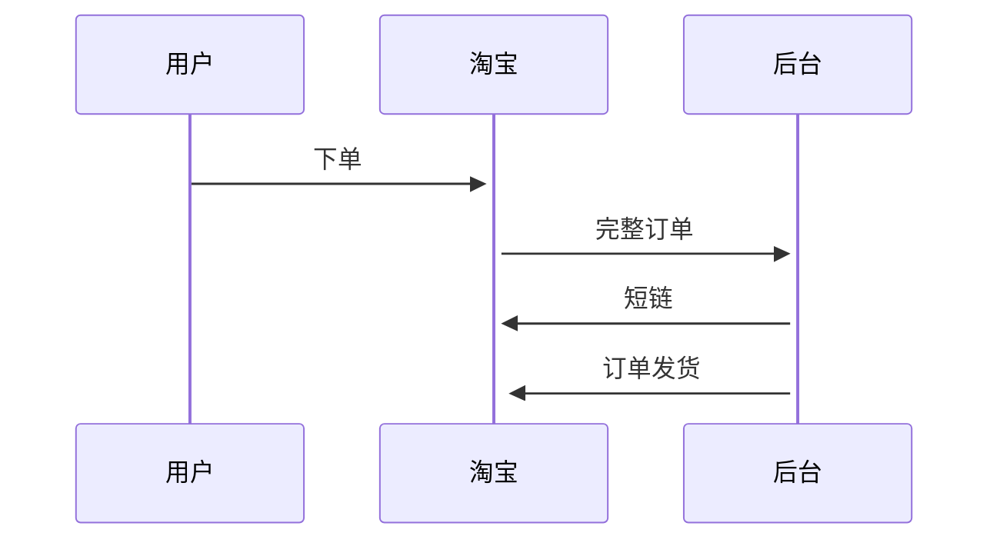
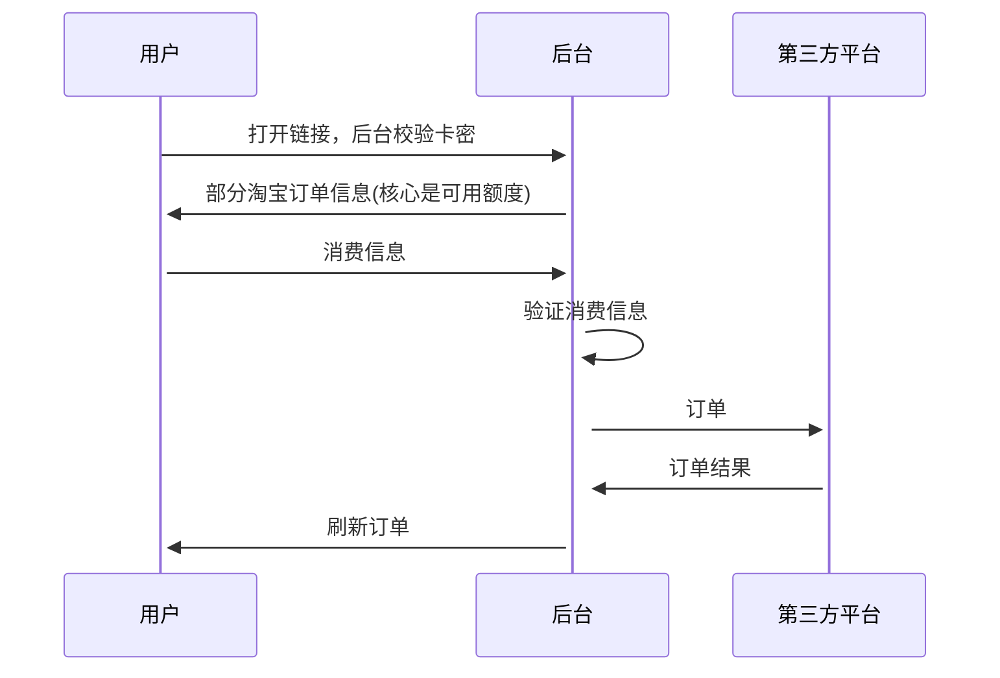
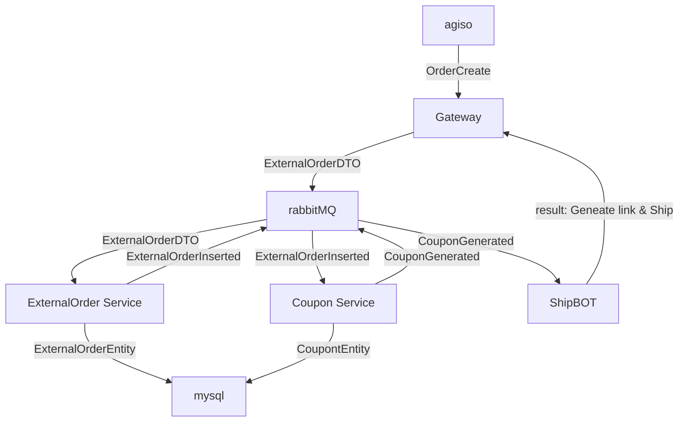
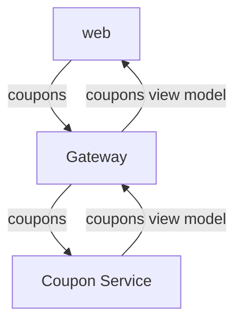
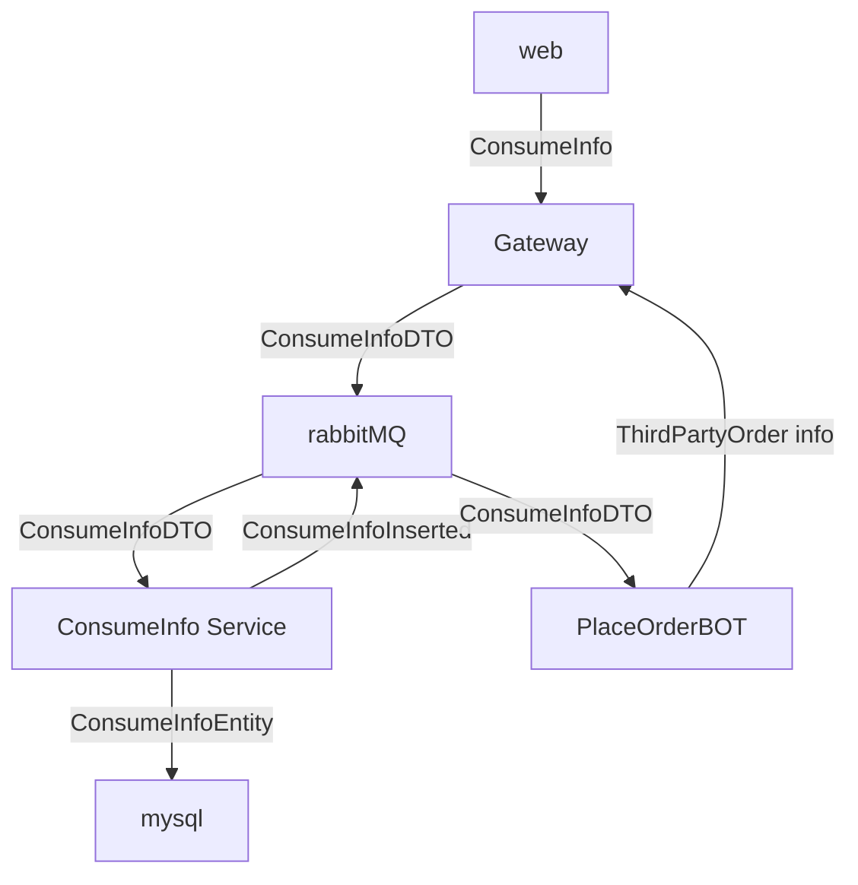

## Description
一个关于代下单的程序集合
第一次开源，很多不规范，有问题可以提issue

主要部分：
  1. Call Agiso api
  2. Call Sexytea api
  3. ExternalOrder/Coupon/ConsumeInfo 的CRUD
  4. RabbitMQ解耦

一些技术：
  1. redis缓存，也会用到pub/sub
  2. JWT (目前是单token)
  3. RabbitMQ 解耦

此项目是请求的入口
因为存在很多第三方api，所以没有使用grpc，因为结构可能会经常变；
同时内部使用rabbitmq而不是直接call api，是为了更新某一个service的过程中，可以让mq暂存消息，而不丢失
同时保留了webapi请求的接口，是为了方便给后台保留人工操作

## Flow in business
整体的流程：
1. 客户下单获取短链

2. 客户在短链中消费

## Flow in code
服务的流转：

1. 客户下单获取短链

2. 客户在短链中消费 
2.1 校验

2.2 消费

